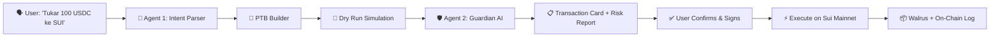

<p align="center">
  <picture>
    <source media="(prefers-color-scheme: dark)" srcset="apps/chat/public/kura-logo-dark-mode.png">
    <source media="(prefers-color-scheme: light)" srcset="apps/chat/public/kura-logo-light-mode.png">
    
  </picture>
  <br/>
  <h1 align="center"><strong>🐢 KURA</strong></h1>
  <p align="center">
    <em>Speak Your DeFi Intent. Execute With Protection.</em>
    <br/>
    <strong>AI-Powered Conversational DeFi Assistant on Sui</strong>
  </p>
  <p align="center">
    <a href="https://kura-landing-page.vercel.app/"></a>
    <a href="https://kura-chat.vercel.app/"></a>
    <a href="https://suiscan.xyz/mainnet/object/0xff9158af19df647bd9f6ab7a6b239d97465dfcfe2341ac2f6a87fff0861c1a20"></a>
    <br/>
    
    
    
    
  </p>
</p>

---

## 📋 Overview

Kura is an **Intent Engine** — a conversational AI assistant that lets you interact with Sui DeFi protocols using natural language. Type `"Tukar 100 USDC ke SUI"` or `"Stake 50 SUI"`, and Kura handles the rest: parsing your intent, building the transaction, simulating it on-chain, analyzing risks via its **Guardian AI**, and presenting a clear report before you sign.



---

## 🌟 Key Differentiators

| Why Kura? | How |
|-----------|-----|
| **🧠 Dual-Agent AI** | Two specialized AI agents: Intent Parser (understands you) + Guardian (protects you) |
| **🛡️ Guardian Layer** | No blind signing. Every transaction gets a pre-execution risk analysis with human-readable reports |
| **🔬 Real On-Chain Simulation** | Uses Sui's `dryRunTransactionBlock` for accurate off-chain simulation — zero gas cost |
| **🗺️ Smart Routing** | Auto-routes swaps via DeepBook V3 mainnet pools for best prices |
| **📜 Immutable Audit Trail** | Every intent & report stored on Walrus + verified on-chain via KuraLogger Move contract |
| **🌏 Bilingual** | Full support for **Bahasa Indonesia** and **English** |
| **🔐 Privacy-First** | Chat sessions auto-clear on wallet disconnect. Keys never leave your device |

---

## 🎯 Supported DeFi Actions

<table>
<thead>
<tr>
<th>#</th>
<th>Action</th>
<th>Protocol</th>
<th>Example</th>
</tr>
</thead>
<tbody>
<tr>
<td>1</td>
<td><strong>Swap</strong></td>
<td><a href="https://deepbook.com/">DeepBook V3</a></td>
<td><code>Tukar 100 USDC ke SUI</code></td>
</tr>
<tr>
<td>2</td>
<td><strong>Stake</strong></td>
<td>Sui Native</td>
<td><code>Stake 50 SUI</code></td>
</tr>
<tr>
<td>3</td>
<td><strong>Unstake</strong></td>
<td>Sui Native</td>
<td><code>Unstake SUI saya</code></td>
</tr>
<tr>
<td>4</td>
<td><strong>Lend</strong></td>
<td><a href="https://scallop.io/">Scallop</a></td>
<td><code>Pinjamkan 100 USDC</code></td>
</tr>
<tr>
<td>5</td>
<td><strong>Borrow</strong></td>
<td><a href="https://scallop.io/">Scallop</a></td>
<td><code>Borrow 50 SUI</code></td>
</tr>
<tr>
<td>6</td>
<td><strong>Provide Liquidity</strong></td>
<td><a href="https://cetus.zone/">Cetus AMM</a></td>
<td><code>Tambah likuiditas USDC-SUI</code></td>
</tr>
<tr>
<td>7</td>
<td><strong>Remove Liquidity</strong></td>
<td><a href="https://cetus.zone/">Cetus AMM</a></td>
<td><code>Cabut likuiditas saya</code></td>
</tr>
<tr>
<td>8</td>
<td><strong>Transfer</strong></td>
<td>Sui Native</td>
<td><code>Kirim 10 SUI ke 0x123...</code></td>
</tr>
<tr>
<td>9</td>
<td><strong>Check Balance</strong></td>
<td>Sui RPC</td>
<td><code>Cek saldo wallet saya</code></td>
</tr>
<tr>
<td>10</td>
<td><strong>Check Price</strong></td>
<td>CoinGecko Oracle</td>
<td><code>Berapa harga SUI?</code></td>
</tr>
</tbody>
</table>

---

## 🏛️ Architecture

```
═══════════════════════════════════════════════════════════════════════════════
                            FRONTEND LAYER (Client)
┌──────────────────┐  ┌──────────────────┐  ┌───────────────────────────────┐
│    Chat UI       │  │  Transaction     │  │   Wallet Connection           │
│  (React/Next.js) │  │  Preview Card    │  │   (@mysten/dapp-kit)          │
│  Tailwind v4     │  │  GuardianReport  │  │   Extension / zkLogin         │
└──────────────────┘  └──────────────────┘  └───────────────────────────────┘
═══════════════════════════════════════════════════════════════════════════════
            HTTP POST (SSE)                Render Response     signAndExecute
                │                                │                    │
                ▼                                │                    ▼
═══════════════════════════════════════════════════════════════════════════════
                     BACKEND & AI LAYER (Vercel - Next.js API)
┌──────────────────────┐  ┌──────────────────┐  ┌──────────────────────────┐
│   Agent 1:           │  │  PTB Builder     │  │   Agent 2:               │
│   Intent Parser      │──▶  Service         │──▶   The Guardian           │
│   (LLM → JSON)       │  │  (@mysten/sui)   │  │   (LLM Risk Analysis)    │
│                      │  │  DeepBook V3     │  │                          │
│                      │  │  Scallop SDK     │  │   Slippage Detection     │
│                      │  │  Cetus AMM       │  │   Pool Liquidity Check   │
└──────────────────────┘  └──────────────────┘  └──────────────────────────┘
═══════════════════════════════════════════════════════════════════════════════
                                        │ emit_log() via PTB
                                        ▼
═══════════════════════════════════════════════════════════════════════════════
                         BLOCKCHAIN LAYER (Sui Mainnet)
┌────────────────────────────┐  ┌──────────────────┐  ┌────────────────────┐
│   KuraLogger Contract      │  │ Sui Mainnet RPC  │  │  DeFi Protocols    │
│   (Move Module)            │  │                  │  │                    │
│   • GuardianReport         │◀─▶ • dryRun         │◀─▶ • DeepBook V3     │
│   • ExecutionLog           │  │ • execute        │  │ • Scallop          │
│   • Events                 │  │ • query          │  │ • Cetus AMM        │
│                            │  │                  │  │ • Sui Native       │
└────────────────────────────┘  └──────────────────┘  └────────────────────┘
═══════════════════════════════════════════════════════════════════════════════

┌─────────────────────────────────────────────────────────────────────────────┐
│                     DECENTRALIZED STORAGE (Walrus)                          │
│  Intent JSON + Guardian Report → Walrus Blobs → Permanent Audit Trail      │
└─────────────────────────────────────────────────────────────────────────────┘
```

### Pipeline Detail (8-Step Flow)

| Step | Component | Description | Duration |
|------|-----------|-------------|----------|
| 1 | **User Input** | Chat UI sends message + context to `/api/chat` | ~100ms |
| 2 | **Intent Parsing** | Agent 1 extracts structured JSON (action, tokens, amount) | ~2s |
| 3 | **Balance Check** | Server verifies user has sufficient tokens via Sui RPC | ~500ms |
| 4 | **Smart Routing** | Auto-selects best DEX route (DeepBook → Cetus fallback) | ~500ms |
| 5 | **PTB Building** | Constructs unsigned Programmable Transaction Block | ~300ms |
| 6 | **Dry Run** | Simulates on-chain via `sui_dryRunTransactionBlock` | ~2s |
| 7 | **Guardian Analysis** | Agent 2 calculates slippage, liquidity risk → report | ~2s |
| 8 | **Client Review** | User sees Transaction Card + Guardian Report, then signs | User-paced |

**End-to-end target: ≤ 10 seconds** (excluding user review time).

---

## 🛡️ Guardian AI Risk Levels

| Level | Label | Condition | UX |
|-------|-------|-----------|-----|
| 0 | 🟢 **Low** | Slippage < 1%, Liquidity > $100K | Direct execution |
| 1 | 🟡 **Medium** | Slippage 1-3%, Liquidity $10K-$100K | Warning shown |
| 2 | 🟠 **High** | Slippage 3-5%, Liquidity $1K-$10K | Checkbox acknowledgment required |
| 3 | 🔴 **Critical** | Slippage > 5%, Liquidity < $1K, or stale pool | Type "KONFIRMASI"/"CONFIRM" to proceed |

---

## 📦 Smart Contract: KuraLogger

Deployed on **Sui Mainnet** — immutable on-chain audit trail for every transaction.

```
Package ID: 0xff9158af19df647bd9f6ab7a6b239d97465dfcfe2341ac2f6a87fff0861c1a20
Explorer:   https://suiscan.xyz/mainnet/object/0xff9158af19df647bd9f6ab7a6b239d97465dfcfe2341ac2f6a87fff0861c1a20
```

### Entry Functions

| Function | Phase | Purpose |
|----------|-------|---------|
| `emit_guardian_report()` | After Guardian analysis | Writes risk report on-chain |
| `confirm_intent()` | User presses "Execute" | Records explicit user confirmation |
| `log_execution()` | After tx confirmed | Links tx digest to report |

### On-Chain Data Flow
```
User Intent  ──→  GuardianReport Object (risk_level, slippage, blob refs)
                          │
                    User Confirms
                          │
                          ▼
                   ExecutionLog Object (tx_digest, timestamps, success)
```

---

## 🛠️ Tech Stack

### Frontend
| Technology | Purpose |
|------------|---------|
| **Next.js 16** | Full-stack React framework (App Router, Turbopack) |
| **Tailwind CSS v4** | Utility-first styling |
| **shadcn/ui + Base UI** | Component primitives |
| **Lucide Icons** | Icon system |
| **React Markdown** | Guardian report rendering |

### Blockchain & DeFi
| Technology | Purpose |
|------------|---------|
| **Sui Blockchain** | Layer-1 blockchain (**Mainnet**) |
| **@mysten/sui v2** | Sui TypeScript SDK |
| **@mysten/dapp-kit** | Wallet integration (extension + zkLogin) |
| **@mysten/deepbook-v3** | DeepBook V3 CLOB DEX (mainnet pools & coins) |
| **@scallop-io/sui-scallop-sdk** | Lending & borrowing protocol |
| **Cetus AMM** | Concentrated liquidity AMM |
| **Sui Move** | Smart contract language |

### AI & Backend
| Technology | Purpose |
|------------|---------|
| **Vercel AI SDK** | LLM orchestration + streaming |
| **OpenAI-compatible API** | Intent Parser + Guardian agents |
| **Zod v4** | Schema validation |
| **Walrus** | Decentralized blob storage |
| **CoinGecko API** | Real-time price oracle |

### Infrastructure
| Technology | Purpose |
|------------|---------|
| **Vercel** | Hosting (chat + landing page) |
| **pnpm workspaces** | Monorepo management |
| **Sui Mainnet RPC** | Blockchain interaction |

---

## 🚀 Quick Start

### Prerequisites
- **Node.js** ≥ 20
- **pnpm** ≥ 9
- **Sui Wallet** (extension) connected to **Mainnet**
- **AI API key** (OpenAI-compatible endpoint)

### Setup

```bash
# 1. Clone & install
git clone https://github.com/SuiKura26/kura.git
cd kura
pnpm install

# 2. Set environment variables (apps/chat/.env.local)
cat > apps/chat/.env.local << EOF
AI_BASE_URL="https://api.your-ai-provider.com/v1"
AI_API_KEY="sk-your-key-here"
AI_MODEL="your-model-name"
NEXT_PUBLIC_SUI_NETWORK="mainnet"
SUI_RPC_URL="https://fullnode.mainnet.sui.io:443"
KURA_LOGGER_PACKAGE_ID="0xff9158af19df647bd9f6ab7a6b239d97465dfcfe2341ac2f6a87fff0861c1a20"
NEXT_PUBLIC_KURA_LOGGER_PACKAGE_ID="0xff9158af19df647bd9f6ab7a6b239d97465dfcfe2341ac2f6a87fff0861c1a20"
COINGECKO_API_KEY="your-coingecko-api-key"
EOF

# 3. Start development
pnpm dev:chat

# 4. Open http://localhost:3000
```

---

## 📂 Project Structure

```
kura/
├── apps/
│   ├── chat/                      # 🤖 Main chat application
│   │   ├── src/
│   │   │   ├── app/
│   │   │   │   ├── api/chat/      # Core API route (orchestration)
│   │   │   │   ├── layout.tsx     # Root layout with providers
│   │   │   │   └── page.tsx       # Main chat page
│   │   │   ├── components/
│   │   │   │   ├── chat/          # Chat UI components
│   │   │   │   │   ├── ChatArea.tsx
│   │   │   │   │   ├── ChatInput.tsx
│   │   │   │   │   ├── GuardianReport.tsx
│   │   │   │   │   ├── LoadingSteps.tsx
│   │   │   │   │   ├── MessageBubble.tsx
│   │   │   │   │   ├── TransactionCard.tsx
│   │   │   │   │   └── WelcomeScreen.tsx
│   │   │   │   ├── layout/        # Layout components (sidebar, header)
│   │   │   │   ├── ui/            # shadcn/ui primitives
│   │   │   │   ├── sui-provider.tsx
│   │   │   │   └── theme-provider.tsx
│   │   │   ├── data/              # Static data & configurations
│   │   │   ├── hooks/
│   │   │   │   └── useChat.ts     # Chat state management
│   │   │   ├── lib/
│   │   │   │   ├── agents/
│   │   │   │   │   ├── intent-parser.ts   # Agent 1: NLP → IntentJSON
│   │   │   │   │   └── guardian.ts        # Agent 2: Risk analysis
│   │   │   │   ├── services/
│   │   │   │   │   ├── ptb-builder.ts     # PTB construction (all actions)
│   │   │   │   │   ├── deepbook-swap.ts   # DeepBook V3 mainnet swap
│   │   │   │   │   ├── scallop-integration.ts  # Scallop lend/borrow
│   │   │   │   │   ├── cetus-integration.ts    # Cetus LP add/remove
│   │   │   │   │   ├── dry-run.ts         # On-chain simulation
│   │   │   │   │   ├── wallet-scanner.ts  # Balance & portfolio check
│   │   │   │   │   ├── price-oracle.ts    # CoinGecko price feeds
│   │   │   │   │   └── walrus.ts          # Walrus blob storage
│   │   │   │   └── schemas.ts     # Zod validation schemas
│   │   │   └── types/             # TypeScript definitions
│   │   └── public/                # Static assets (logos, icons)
│   ├── landing-page/              # 🌐 Marketing site (kura-landing-page.vercel.app)
│   │   └── src/                   # Next.js 16 app
│   └── smart-contracts/           # 📜 KuraLogger Move module
│       ├── sources/
│       │   └── logger.move        # Move smart contract source
│       ├── tests/
│       │   └── security_tests.move  # 17 security test cases (all passed)
│       ├── Move.toml              # Package manifest (mainnet framework)
│       └── Published.toml         # Published package info
├── docs/
│   └── PRD.md                     # Product Requirements Document
├── env/
│   └── .env.production            # Production environment config
├── package.json                   # Root workspace config
├── pnpm-workspace.yaml            # Monorepo config (apps/*)
└── pnpm-lock.yaml                 # Lockfile
```

---

## 🔐 Security Architecture

- **No Server-Side Signing** — Backend constructs unsigned PTBs only; signing happens client-side via dapp-kit
- **Pre-Execution Simulation** — Every transaction is dry-run before the user sees it
- **Explicit Confirmation** — 2-step flow: review report → press "I Understand & Execute" → wallet popup
- **Immutable Audit Trail** — On-chain KuraLogger contract stores every report & execution permanently
- **Rate Limited** — 30 req/min per IP on `/api/chat`
- **Auto-Clear Privacy** — Sessions wipe on wallet disconnect
- **Credential Protection** — `.gitignore` configured to block all `.env`, `.key`, `.pem`, and `.private` files

---

## 📚 Documentation

| Document | Description |
|----------|-------------|
| [`docs/PRD.md`](docs/PRD.md) | Full Product Requirements Document (Bahasa Indonesia) |

---

## 🧪 Scripts

| Command | Description |
|---------|-------------|
| `pnpm dev` | Run all apps in parallel |
| `pnpm dev:chat` | Run chat app only |
| `pnpm dev:landing-page` | Run landing page only |
| `pnpm build:chat` | Build chat app for production |
| `pnpm build` | Build all apps |
| `pnpm lint` | Run linters across all apps |

---

## 🌐 Live Deployments

| Property | URL |
|----------|-----|
| **Chat App** | [https://kura-chat.vercel.app/](https://kura-chat.vercel.app/) |
| **Landing Page** | [https://kura-landing-page.vercel.app/](https://kura-landing-page.vercel.app/) |
| **Smart Contract** | [Sui Mainnet Explorer](https://suiscan.xyz/mainnet/object/0xff9158af19df647bd9f6ab7a6b239d97465dfcfe2341ac2f6a87fff0861c1a20) |

---

## 👥 Team

Built with ❤️ for **Sui Overflow 2026** — the global Sui hackathon.

---

## 📄 License

[MIT](LICENSE)
